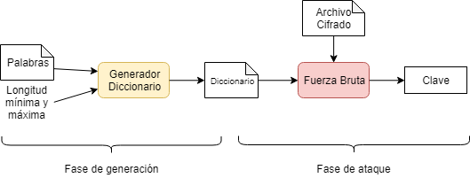
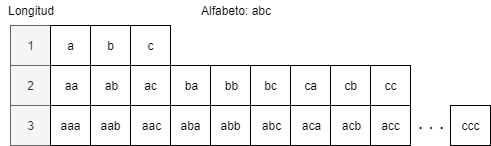

## Ataque de diccionario


Pequeño script escrito en python, utilizado para comprobar conceptualemte como funcionan este tipos de ataques a groso modo. Esta dirigido a archivos zip comprimidos en ZipCrypto.

Existen dos fases de generación, la creación del diccionario a partir de lista de palabras y una longitud máxima de combinación, para porteriormente comporbar todos las claves del diccionario sobre el archivo comprimido.

### Uso
1. Generar el diccionario, pudiendo indicar además de las cadenas iniciales, la longitud máxima de combinación y el destino del archivo.

```shell
$ python3 diccionario/diccionario.py 1 5 -p datos.txt
Datos cargados del fichero: ./datos.txt
Número de combinaciones: 579194

Longitud 1 |■■■■■■■■■■■■■■■■■■■■■■■■■■■■■■■■■■■■■■■■| 100% Completado
Longitud 2 |■■■■■■■■■■■■■■■■■■■■■■■■■■■■■■■■■■■■■■■■| 100% Completado
Longitud 3 |■■■■■■■■■■■■■■■■■■■■■■■■■■■■■■■■■■■■■■■■| 100% Completado
Longitud 4 |■■■■■■■■■■■■■■■■■■■■■■■■■■■■■■■■■■■■■■■■| 100% Completado
Longitud 5 |■■■■■■■■■■■■■■■■■■■■■■■■■■■■■■■■■■■■■■■■| 100% Completado

Tiempo transcurrido: 8.74589s
Diccionario generado: diccionario.txt
```

2. Una vez generado el diccionario, indicamos el archivo comprimido y el diccionario, para comprobar una a una las claves del diccionario.

```shell
$ python3 fuerzaBruta/fuerzaBruta.py -c comprimido.zip -d diccionario.txt

 |■■■■■■■■■■■■■■■■■■■■■■■-----------------| 60% Completado

Tiempo transcurrido: 13.82808s
Clave: gato85gomez
```
### Formato archivo de cadenas
Este se usa como los datos iniciales para generar el diccionario, se trata de un archivo de texto en el cual cada línea contiene una única palabra sin espacios. Ilustramos con el siguiente ejemplo.

```txt
pedro
garcia
rubio
```
### Salida del diccionario
```txt
...
igap
igae
igad
igar
igao
igag
igaa
igac
igai
igau
igab
igcp
...
```

### Ayuda

1. diccionario.py

```shell
$ python3 fuerzaBruta/fuerzaBruta.py -h
usage: diccionario.py [-h] min max -p PALABRAS [-d DESTINO]

positional arguments:
  min                   Longitud mínima de combinaciones
  max                   Longitud máxima de combinaciones

optional arguments:
  -h, --help            show this help message and exit
  -p PALABRAS, --palabras PALABRAS
                        Lista de cadenas de entrada
  -d DESTINO, --destino DESTINO
                        Directorio del diccionario generado
```

2. fuerzaBruta.py

```shell
$ python3 fuerzaBruta/fuerzaBruta.py -h
usage: fuerzaBruta.py [-h] -c COMPRIMIDO -d DICCIONARIO [-a ARCHIVODESTINO]

optional arguments:
  -h, --help            show this help message and exit
  -c COMPRIMIDO, --comprimido COMPRIMIDO
                        archivo comprimido de entrada
  -d DICCIONARIO, --diccionario DICCIONARIO
  -a ARCHIVODESTINO, --archivoDestino ARCHIVODESTINO
                        directorio del archivo extraido
```

### Algoritmo de generación
Producto cartesiano de vector de caracteres, iniciando con las palabras base; se trata de todas las posibles combinaciones de un juego de caracteres con repetición.



### Modulos utilizados
- itertools
- argparse
- time
- zipfile

### Problemas
1. Eficiencia del algoritmo producto cartesiano
2. Uso de hilos
3. Eficiencia de descompresion de zipLib
4. ziplib funciona con ZipCrypto y no con AES-256 (compresión en 7zip)
